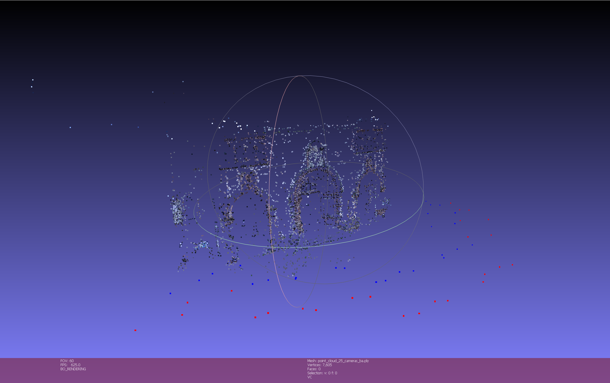
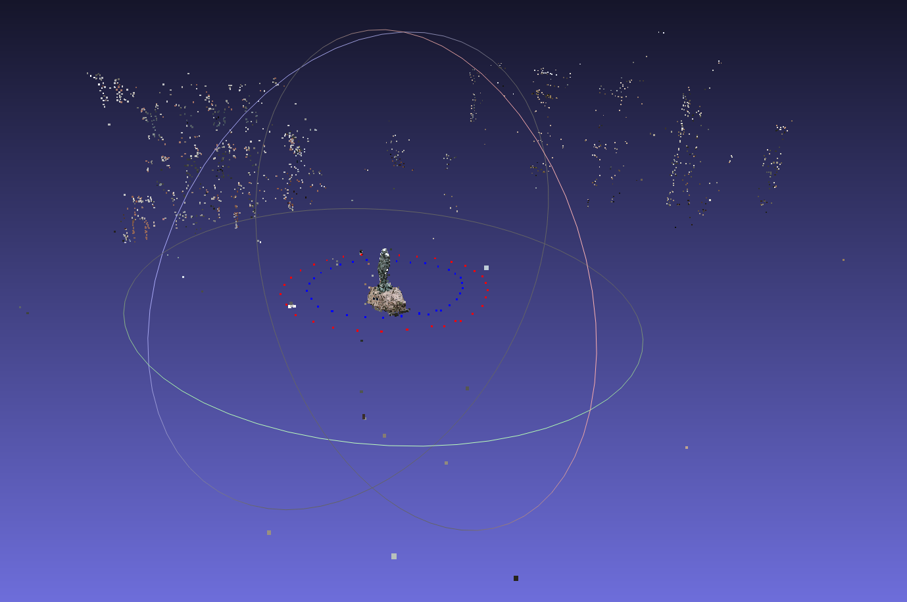

// Убедитесь что название PR соответствует шаблону:
// Task04 <ИмяНаРусском> <ФамилияНаРусском> <ВУЗ>

// Проверьте что обе ветки PR - task04 (отправляемая из вашего форкнутого репозитория и та в которую вы отправляете PR)

# Перечислите идеи и коротко обозначьте мысли которые у вас возникали по мере выполнения задания, в частности попробуйте ответить на вопросы:

1) test_ceres_solver/FitLine: почему найденная прямая и эталонная - не совпадают? Как это исправить пост-обработкой? Как это исправить формулировкой задачи?

Потому что уравнение прямой не меняется от домножения на константу, а наш алгоритм этого не учитывает. Можно просто нормализовать, поделив все слагаемые на какое то из них. В целом, это равносильно фиксации одного из коэффицентов равным 1. Наверное так можно переформулировать задачу, но мне было лень.

2) BA: представьте что вы написали преобразование phg::Calibration -> блок параметров и обратное блок параметров -> phg::Calibration. Как проверить простым образом что эти преобразования сделаны корректно? Что должно быть в логе про процент inliers до/после BA если runBA() вызывать всегда два раза пордяд? Иначе говоря - что следует из того что в идеале runBA() должна быть (мне очень нравится это слово) - [идемпотентна](https://ru.wikipedia.org/wiki/%D0%98%D0%B4%D0%B5%D0%BC%D0%BF%D0%BE%D1%82%D0%B5%D0%BD%D1%82%D0%BD%D0%BE%D1%81%D1%82%D1%8C)?

По хорошему, повторное применение BA должно оставить процент inliers тем же, потому что камеры уже откалиброваны и калибровать там больше нечего. Получается что если наш BA не уменьшает количество инлайеров при повторном применении, то это укрепляет веру в то, что он написан хорошо.

3) Какое максимальное число кадров у вас получилось хорошо выравнять для каждого из датасетов? (проверьте хотя бы saharov32 и herzjesu25) Не забудьте приложить скриншоты.

Получилось выровнять все, вот скрины

Тут почему то левый угол куда то полетел, но в целом результат выглядит неплохо

4) Если бы вычисления в double были абсолютно точны - можно ли было бы назвать вычисления в Calibration::project/unproject строго зеркальными?

Нет. Unproject не может посчитать точное значение для r, потому что есть зависимость r <-> x, y и одно не получить точно без другого. Мы можем только приближать значение r по искаженным x и y

5) Почему фокальная длина меняется от того что мы уменьшаем картинку? Почему именно f/downscale?

Потому что уменьшение = отдаление картинки от нашей камеры. Ч

6) Имеет ли право BA двигать точку отсчета системы координат (т.е. добавить константу ко всем координатам)? Как это повлияет на суммарную Loss?

Ну вообще, по идее, да. Мы же просто сдвинем всю систему в пространстве, от этого относительное положение камер и точек не поменяется и картина должна остаться корректной. На Loss тоже вряд ли повлияет, мы его считаем как point - observed_point. Если сдвинуть, то, вроде, ничего не изменится. Но вообще зависит от реализации, может быть мы что то там гвоздями прибиваем (например GPS) и тогда будет грустно

7) Каким образом можно гарантировать чтобы при сравнении нескольких последовательно построенных облаков точек одного и того же датасета (созданных по мере добавления фотографии за фотографией) в MeshLab - облака не были хаотично смещены/отмасштабированы/повернуты друг от друга?

Ну можно первую камеру гвоздями в 0 0 0 например прибить, поворот сделать такой, чтобы картинка лежала параллельно какой то конкретной плоскости координат и угол быд меньше или равен pi. С масштабом как будто сложнее всего, можно наверное как то нормировать вообще все измерения, но я не очень понимаю как. 

100) Если есть - фидбек/идеи по улучшению задания.

// Создайте PR.
// Дождитесь отработки Github Actions CI, после чего нажмите на зеленую галочку -> Details -> The build -> скопируйте весь лог тестирования.
// Откройте PR на редактирование (сверху справа три точки->Edit) и добавьте сюда скопированный лог тестирования внутри тега <pre> для сохранения форматирования и под спойлером для компактности и удобства:

Github Actions CI

<pre>
$ ./build/test_sift
Running main() from /home/runner/work/PhotogrammetryTasks2023/PhotogrammetryTasks2023/libs/3rdparty/libgtest/googletest/src/gtest_main.cc
[==========] Running 22 tests from 1 test suite.
[----------] Global test environment set-up.
[----------] 22 tests from SIFT
[ RUN      ] SIFT.MovedTheSameImage
[ORB_OCV] Points detected: 500 -> 500 (in 0.021269 sec)
...
Final score: 239001
[       OK ] SIFT.PairMatching (0 ms)
[----------] 25 tests from SIFT (7264 ms total)
[----------] Global test environment tear-down
[==========] 25 tests from 1 test suite ran. (7264 ms total)
[  PASSED  ] 25 tests.
</pre>

