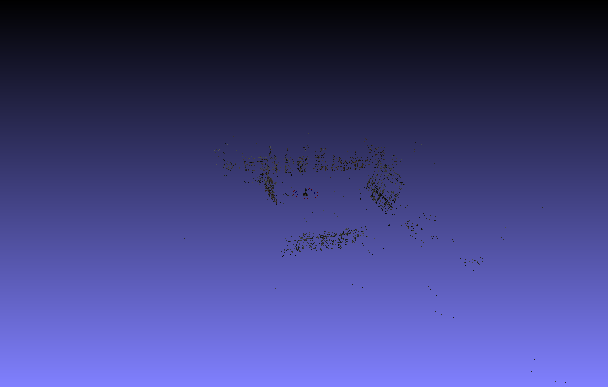
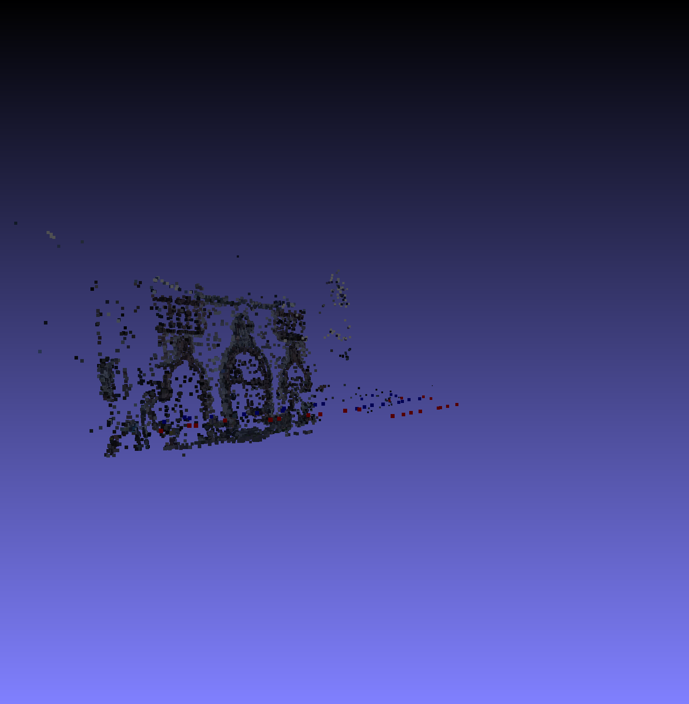

# Перечислите идеи и коротко обозначьте мысли которые у вас возникали по мере выполнения задания, в частности попробуйте ответить на вопросы:

1) test_ceres_solver/FitLine: почему найденная прямая и эталонная - не совпадают? Как это исправить пост-обработкой? Как это исправить формулировкой задачи?\
\
Прямые геометрически совпадают (одна прямая задается семейством наборов коэффициентов {a, b, c}, определенных с точностью до масштаба), коэффициенты же могут отличаться масштабом. \
На постобработке можно исправить, поделив коэффициенты на некий скейл (такой, чтобы c_0==c_ideal, тут можно любой из коэффициентов приравнять, но в решении c имеет наибольший модуль и вычисления получаются более стабильными?)\
В формулировку задачи можно добавить ограничение на величину одного из коэффициентов или на длину вектора (a, b)

2) BA: представьте что вы написали преобразование phg::Calibration -> блок параметров и обратное блок параметров -> phg::Calibration. Как проверить простым образом что эти преобразования сделаны корректно? Что должно быть в логе про процент inliers до/после BA если runBA() вызывать всегда два раза пордяд? Иначе говоря - что следует из того что в идеале runBA() должна быть (мне очень нравится это слово) - [идемпотентна](https://ru.wikipedia.org/wiki/%D0%98%D0%B4%D0%B5%D0%BC%D0%BF%D0%BE%D1%82%D0%B5%D0%BD%D1%82%D0%BD%D0%BE%D1%81%D1%82%D1%8C)?\
\
Написать темплейт-функцию, считающую, например, проекцию точки в фокальную плоскость и сделать ассерт на равенство проекций. \
Идемпотентность означает, что BA(BA(X)) = BA(X) => результат (процент inliers после однократного/двухкратного BA) должен совпадать.

3) Какое максимальное число кадров у вас получилось хорошо выравнять для каждого из датасетов? (проверьте хотя бы saharov32 и herzjesu25) Не забудьте приложить скриншоты. \
\
saharov32 -- 32/32 
herzjesu25 -- 22/25 

4) Если бы вычисления в double были абсолютно точны - можно ли было бы назвать вычисления в Calibration::project/unproject строго зеркальными? \
\
Нет, т.к. мы полностью теряем информацию о координате z исходной точки. Кстати, в задании 3 при условии обратимости матрицы K project/unproject были взаимно обратными. Мне кажется стоит в задании 3 функционал проецирования однородных координат также перенести в project.

5) Почему фокальная длина меняется от того что мы уменьшаем картинку? Почему именно f/downscale? \
\
$x_p = x_r \dfrac{f}{z} \Leftrightarrow x_r = \dfrac{x_p}{f} * z$ . \
При даунсемпле картинки в s раз $x_p^{'} = \dfrac{x_p}{s} \Rightarrow $ \
$x_r^{'} = \dfrac{x_p^{'}}{f} * z = \dfrac{x_p / s} {f} * z = \dfrac{x_p}{(f^{'} * s)} * z$ \
Так как $x_r^{'} = x_r \Rightarrow f^{'} * s = f \Rightarrow f^{'} = \dfrac{f}{s}$

6) Имеет ли право BA двигать точку отсчета системы координат (т.е. добавить константу ко всем координатам)? Как это повлияет на суммарную Loss? \\
В целом может, но зачем, это же не изменит координат векторов, не повлияет на Loss.

7) Каким образом можно гарантировать чтобы при сравнении нескольких последовательно построенных облаков точек одного и того же датасета (созданных по мере добавления фотографии за фотографией) в MeshLab - облака не были хаотично смещены/отмасштабированы/повернуты друг от друга? \\
Не оптимизировать параметры уже добавленных камер -- использовать систему координат 0-й камеры как якорную. Таким образом при сравнении в качестве осей брать оси 0-й камеры, в качестве масштаба брать среднее расстояние до триангулированных метчей первых двух камер. А еще лучше -- расстояние между первыми двумя камерами

100) Если есть - фидбек/идеи по улучшению задания.
Сделать более плавный переход от 3 задания к 4-му (как минимум project/unproject). 